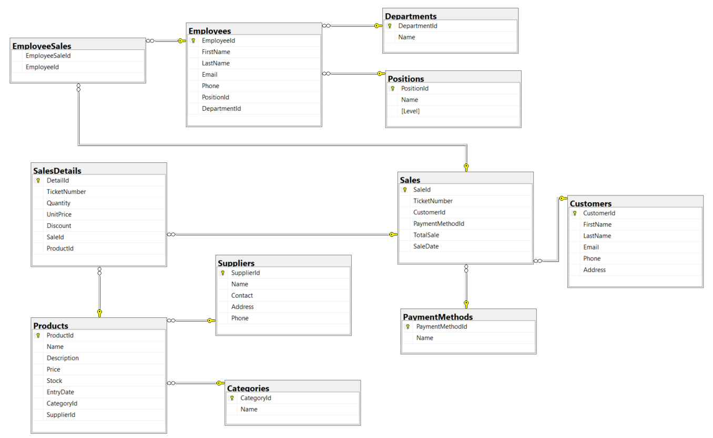
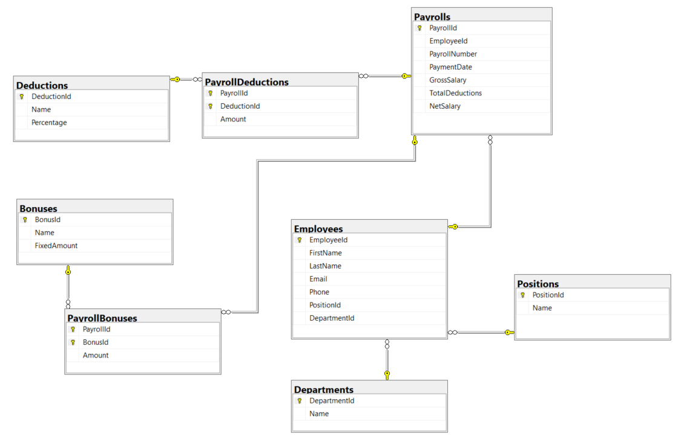
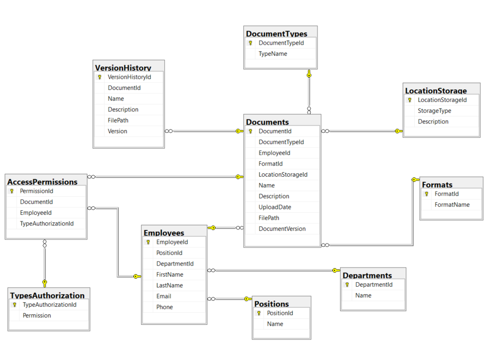
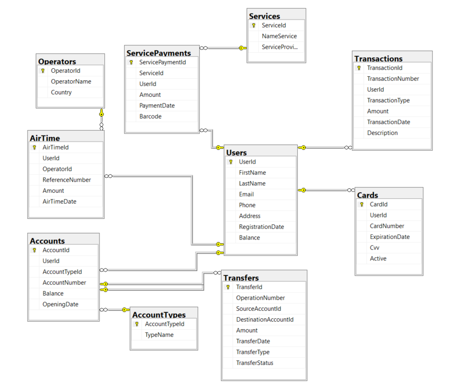
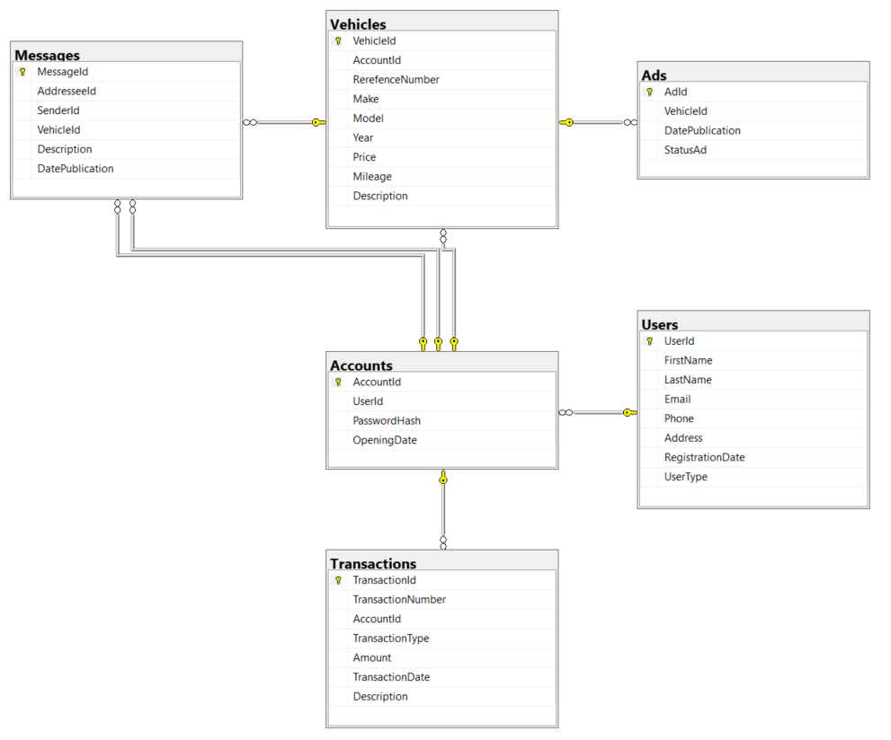

# SQLProjectsBundle

## Name

Project Bundle

## Description

This repository contains a collection of SQL projects (SQL Server), each focused on a specific functionality. A description of each project and instructions on how to use them are provided below.

### 1. Inventory and Sales Management

Description: Scripts SQL to manage inventories and sales. Includes tables for products, sales, customers and inventory.

Instructions:

    Main files: inventory-and-sales-management-tables.sql,
    Usage: Run the scripts to create the required tables and use the procedure to manage sales and inventory operatios.

### 2. Payrolls Management

Description: SQL scripts for payroll management, including tables for employees, salaries, deductions.

Instructions:

    Main files: payrolls-management-tables.sql,
    Usage: Run the scripts to create the required tables and use the procedure to calculate and record payroll.

### 3. Digitalization Documents

Description: SQL scripts for document digitalization and management,
including document tables, metadata and access permissions.

Instructions:

    Main fiiles: digitalization-documents-table.sql
    Usage: Execute the scripts to create the tables and procedures necessary for the management of digitized documents.

### 4. Bank Management

Description: SQL scripts for bank management, including accounts, transactions, customers.

Instructions:

    Main files: bank-management-tables.sql
    Usage: Execute the scripts to set up the database structure and use the procedures to manage bank transactions

### 5. Pre-owned Management

Description: SQL scripts for the management of used vehicles, including tables for products, sales customers.

Instructions:

    Main files: pre-owned-tables.sql
    Usage: Execute the scripts to create and populate the tables, and use the procedures to manage the pre-owned sales transactions.

